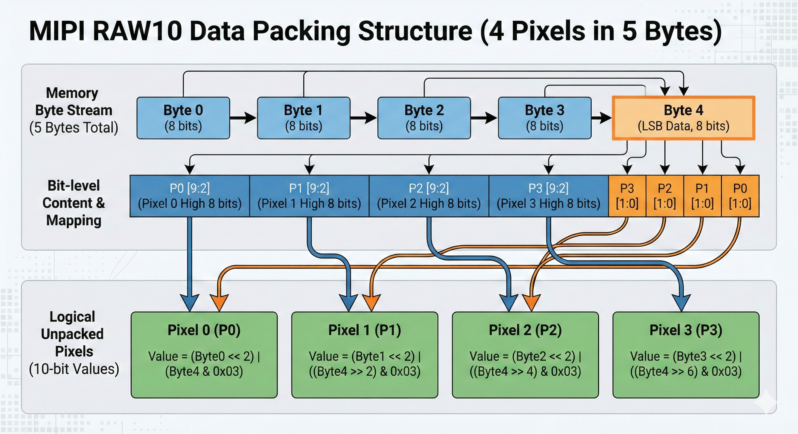
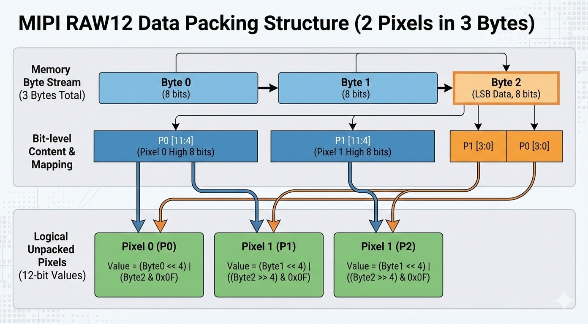

# MIPI2RAW（非严格意义isp流程）

在嵌入式视觉开发或 ISP（图像信号处理）流水线中，我们从 Sensor 获取的第一手数据通常不是标准的图像格式，而是紧凑排列的 MIPI RAW 数据。为了节省传输带宽，MIPI CSI-2 协议通常会将像素的低位数据“挤压”存储。比如一个 10-bit 的像素，如果直接用 16-bit (2 Bytes) 存储会浪费 6-bit 空间。因此，MIPI 采用了一种 **Compact Packing（紧凑打包）** 格式。
在将数据送入 ISP 或后续算法处理之前，我们需要进行一步 **Unpacking（解包）** 操作，将其还原为计算机易于处理的 Linear RAW (16-bit) 格式。

## 核心概念：Width vs Stride

在处理 RAW 数据时，必须区分两个宽度的概念：
1. Width (像素宽)：图像一行有多少个像素点（例如 1920）。
2. Width_Mipi / Stride (字节宽)：图像一行在内存中实际占用的字节数。

代码中可以通过两者比例来判断数据格式的，大致为：RAW10：```Stride ≈ Width × 1.25```；RAW12：```Stride ≈ Width × 1.5```。

## RAW10 格式解包原理

这是最常见的 Sensor 输出格式。它将 4 个像素（每个 10-bit）的数据压缩在 5 个字节中, 前 4 个字节分别存储 4 个像素的高 8 位（MSB），第 5 个字节存储这 4 个像素的低 2 位（LSB）。其内存结构图如下所示：



还原逻辑是通过位运算将数据拼接回 16-bit (有效位 10-bit)： ```P0 = (Byte0 << 2) | ((Byte4 >> 0) & 0x03)```

## RAW12 格式解包原理

这类数据格式往往用于高精度场景。它将 2 个像素（每个 12-bit）的数据压缩在 3 个字节中，前 2 个字节存高 8 位，第 3 个字节存低 4 位。其内存结构图如下所示：



还原逻辑是通过位运算将数据拼接回 16-bit (有效位 12-bit)： ```P0 = (Byte0 << 4) | ((Byte2 >> 0) & 0x0F)```

下面的 C++ 代码展示了具体的转换函数 Mipi2Raw。它利用 cv::Mat 作为内存容器，直接操作指针进行位运算，实现了从内存紧凑格式到 16-bit 线性格式的高效转换：

```cpp
cv::Mat Mipi2Raw(const char *srcName, 
                 int width, 
                 int height, 
                 int width_mipi, 
                 const char *dstName = "") {
    FILE *fp;
    unsigned char *pRawData = (unsigned char *)malloc(width_mipi * height * sizeof(unsigned short));
    if (pRawData == nullptr) {
        printf("Fail to calloc buf\r\n");
    }
    if ((fp = fopen(srcName, "rb")) == nullptr) {
        printf("Fail to read %s.\r\n", srcName);
    }
    int ret = fread(pRawData, sizeof(unsigned char) * width_mipi * height, 1, fp);
    if (ret != 1) {
        printf("Fail to read raw data\r\n", srcName);
    }
    cv::Mat img(cv::Size(width_mipi, height), CV_8UC1, pRawData);

    // 2) 为输出的 16bit 图像分配内存
    cv::Mat raw16(cv::Size(width, height), CV_16UC1);

    // 3) 按行解包 RAW10 / RAW12 到 16bit
    if (width_mipi < width * 12 / 8 && width_mipi >= width * 10 / 8) {
        // 10bit RAWMIPI 数据
        for (int y = 0; y < height; y++) {
            // 行缓冲区
            const uint8_t *lineBuf = img.ptr<uint8_t>(y);
            uint16_t *dst = raw16.ptr<uint16_t>(y);

            int idx = 0;
            for (int x = 0; x < width; x += 4) {
                uint8_t b0 = lineBuf[idx + 0];
                uint8_t b1 = lineBuf[idx + 1];
                uint8_t b2 = lineBuf[idx + 2];
                uint8_t b3 = lineBuf[idx + 3];
                uint8_t b4 = lineBuf[idx + 4];

                dst[x + 0] = (b0 << 2) | ((b4 >> 0) & 0x03);
                dst[x + 1] = (b1 << 2) | ((b4 >> 2) & 0x03);
                dst[x + 2] = (b2 << 2) | ((b4 >> 4) & 0x03);
                dst[x + 3] = (b3 << 2) | ((b4 >> 6) & 0x03);

                idx += 5;
            }
        }
    }
    else if (width_mipi >= width * 12 / 8) {
        // 12bit RAWMIPI 数据
        for (int y = 0; y < height; y++) {
            // 行缓冲区
            const uint8_t *lineBuf = img.ptr<uint8_t>(y);
            uint16_t *dst = raw16.ptr<uint16_t>(y);

            int idx = 0;
            for (int x = 0; x < width; x += 2) {
                uint8_t b0 = lineBuf[idx + 0];
                uint8_t b1 = lineBuf[idx + 1];
                uint8_t b2 = lineBuf[idx + 2];

                dst[x + 0] = (b0 << 4) | ((b2 >> 0) & 0xF);
                dst[x + 1] = (b1 << 4) | ((b2 >> 4) & 0xF);

                idx += 3;
            }
        }
    }
    else {
        // 错误数据
    }

    // 4) 直接将 16bit 数据写回到 raw 文件
    if (dstName != "") {
        std::ofstream ofs("output_linear16.raw", std::ios::binary);
        if (!ofs) {
            std::cerr << "无法打开输出文件\n";
        }
        ofs.write(reinterpret_cast<const char *>(raw16.data), raw16.total() * raw16.elemSize());
        ofs.close();

        std::cout << "16bit raw 文件已生成：output_linear16.raw\n";
    }

    return raw16;
}
```
